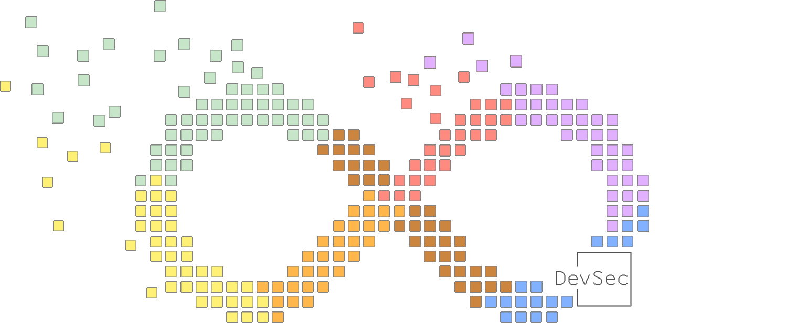

[](https://t.me/taradaidv)
[](https://www.oracle.com/java/)
[](https://portswigger.net/burp/)
[](https://github.com/taradaidv/goscout/tree/main)

# DevSecBox Extension for Burp Suite

</div><p align="center"></p>

## Overview

**DevSecBox** is a cutting-edge extension for Burp Suite that serves as a powerful orchestrator for Bug Hunters and DevSecOps tasks. It acts as an adapter for your macOS, Linux, or Windows command line, allowing you to run shell scripts, PowerShell scripts, or any program, and even compile code in any language directly from its environment. This makes it a breeze to integrate with a ton of DevSecOps tools like AI, Kubernetes, LXC, Docker, nmap, and other utilities. It autonomously kicks off and manages complex security workflows, offering virtually limitless possibilities limited only by your imagination.

## Images
<table>
<td>


</td>
<td>


</td>
<td>


</td></tr>

</table>

## Features

- **Workflow Management**: Visualize and manage security testing workflows using a drag-and-drop interface, enabling seamless integration into DevSecOps practices.
- **Live and Manual Modes**: Switch between live and manual workflow modes to accommodate different stages of the security testing process.
- **Task Automation**: Automate repetitive tasks with customizable triggers and actions, reducing manual intervention and speeding up the testing process.
- **Request/Response Handling**: Capture, modify, and replay HTTP requests and responses, essential for testing application security in a DevOps environment.
- **JSON Processing**: Import, export, validate, and beautify JSON data, facilitating data handling in microservices and API-driven architectures.
- **Customizable UI**: Adjust the interface to fit your workflow needs with zoom and layout options, enhancing usability for DevSecOps teams.
- **Audit Integration**: Integrate with Burp's scanning capabilities to identify and report security issues, providing actionable insights for developers and security teams.
- **Spoofing Capabilities**: Replace request/response data with custom values for testing, useful for simulating different environments and conditions.

## DevSecOps Context

### Integration in Security Workflows

- **Autonomous Orchestration**: DevSecBox autonomously triggers and manages security tasks based on predefined conditions, executing scripts and programs as needed.
- **Continuous Testing**: Perform continuous security testing, ensuring vulnerabilities are identified and addressed early in the development lifecycle.
- **Automated Security Checks**: Automate security checks as part of the testing process, providing immediate feedback to developers.
- **Shift-Left Security**: By incorporating DevSecBox into the development process, security is shifted left, allowing teams to address issues before they reach production.

### Collaboration

- **Cross-Functional Teams**: DevSecBox facilitates collaboration between development, security, and operations teams by providing a common platform for security testing.
- **Shared Insights**: Generate reports and insights that can be shared across teams, promoting a culture of security awareness and responsibility.

### Compliance and Governance

- **Policy Enforcement**: Ensure compliance with security policies and standards by integrating DevSecBox into governance frameworks.
- **Audit Trails**: Maintain audit trails of security testing activities, supporting compliance and regulatory requirements.

## Build 

```
gradle wrapper
./gradlew clean build --refresh-dependencies
```

## TODO
There are lots of great things that could be added to this extension.

- **Enhanced Security Features**: Implement advanced security measures to protect user data and ensure the extension remains resilient against potential threats.

- **AI Integration**: Facilitate seamless integration with AI tools to enhance functionality and provide smarter, more efficient solutions for users.

- **User-Friendly Interface**: Continuously improve the UI/UX to ensure a smooth and intuitive user experience.

- **Community Feedback**: Actively gather and incorporate feedback from the community to drive improvements and new feature development.


## Why does the project need donations ?

- **Documentation & Examples**: Donations help us dedicate time to create detailed docs and real-world case examples, helping users get the most out of the extension.

- **Security & Testing**: Regular testing and audits are crucial to spot and fix vulnerabilities, keeping the extension secure and reliable for everyone.

- **Community Support**: Building and supporting an active community makes the extension more popular and useful, encouraging sharing of experiences and ideas.

- **Motivation & Recognition**: Recognizing community contributions inspires new achievements and keeps the enthusiasm alive for ongoing development of the extension.
You can support the project by donating, contributing code, improving documentation, or discussing issues.

## Donation Wallet Addresses

**TON:**
```
UQBesxeEBa8_xrwU8F_e-g49Cf5Hwf8Al5v0VXcDxU9hoUgM
```

**BTC:**
```
15WrGGwGGgDTe3iBQWvZcuFu6ZNQC9ePjU
```