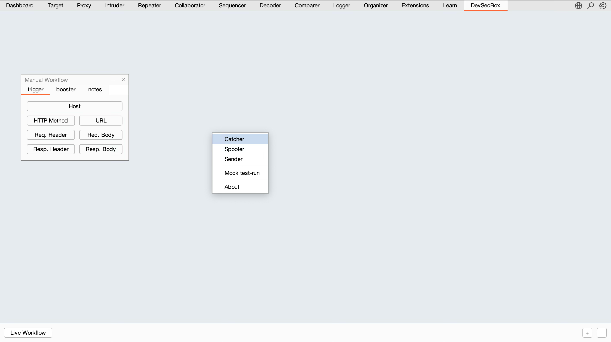
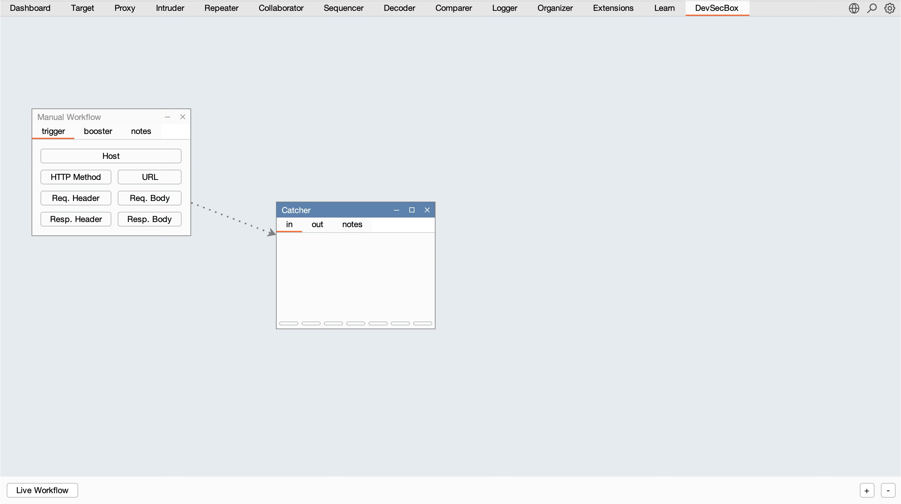
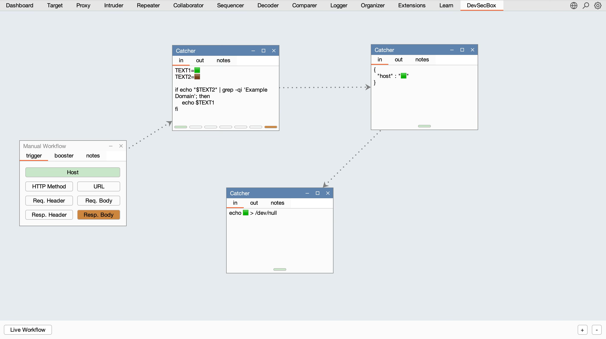
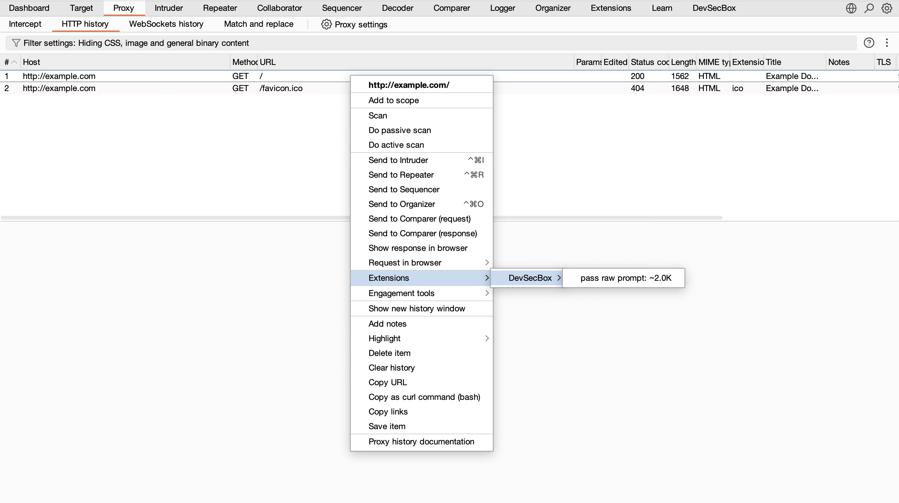
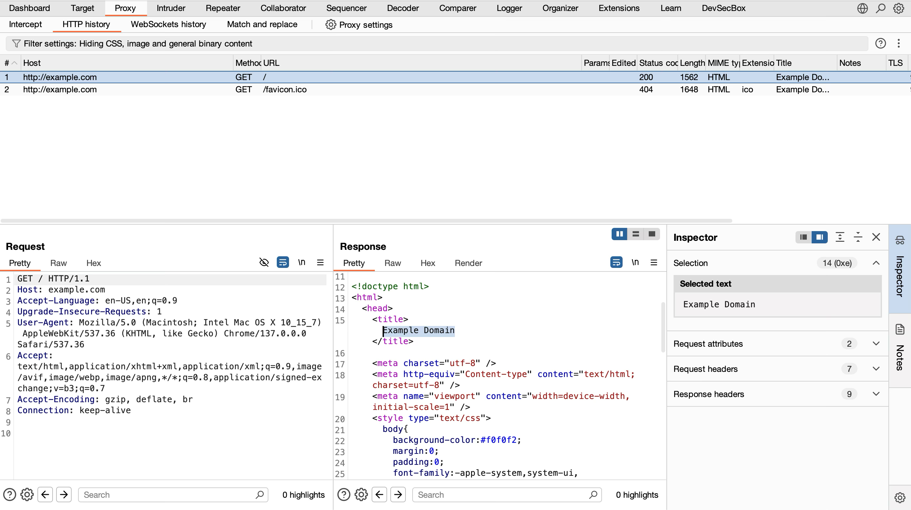
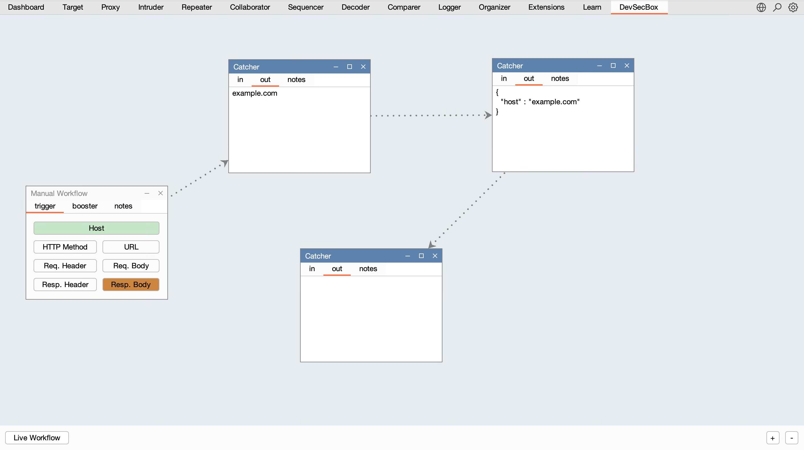
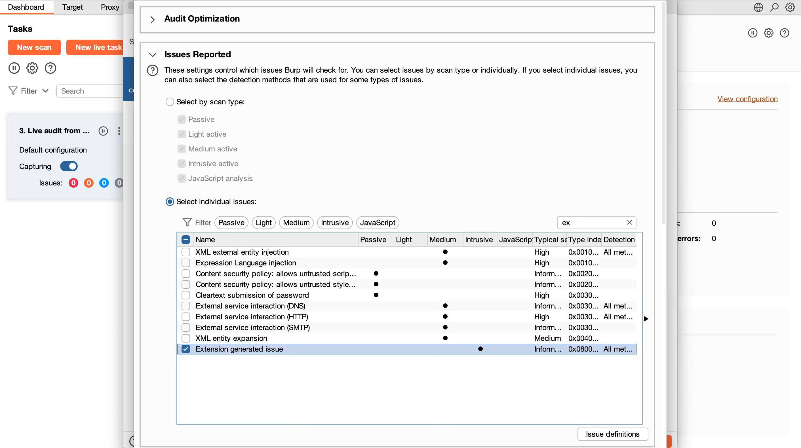
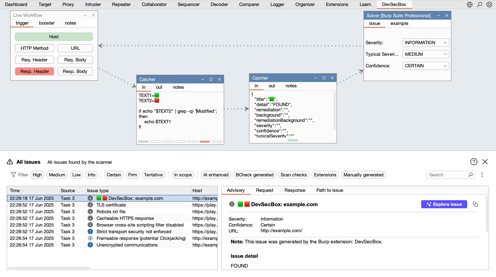

# Extension Usage Instructions

## Operating Modes

In **DevSecBox**, there are two operating modes: **`Live`** and **`Manual`**.

### Description for `Manual` Mode

Manual mode only accepts data from the context menu of the *ToolType.PROXY* or *ToolType.LOGGER*.

The first and main component is the `Trigger`, where you specify which data will be sent to additional handlers in **DevSecBox**.

To select an additional handler in **DevSecBox**, `right-click` on any free area and choose the necessary one from the list. Currently, there are three.
</div><p align="center"></p>

Choose `Catcher`. After selecting, the data flow and direction are shown. In our case, the selected fields in the `Trigger` will be sent for further processing in `Catcher`.
</div><p align="center"></p>

Each HTTP data in the `Trigger` is a block of a certain color, for example, the hostname is a green block 🟩, and the response body is a brown block 🟫.

###  Let's make a simple example:

We browse websites, and if the response body contains the word 'Example Domain', we will create a JSON and save it to the host's disk. In our example, Burp works with the bash command line, so its syntax is used; for Windows, it would be PowerShell syntax, and instead of saving the file to disk, in the example, we will send the data to nowhere `/dev/null`.

In Catcher, we write a native shell script:

```bash
TEXT1=🟩
TEXT2=🟫

if echo "$TEXT2" | grep -qi 'Example Domain'; then
    echo $TEXT1
fi
```

In the `Trigger`, the `Host` and `Resp.Body` data will automatically be highlighted as they are specified in the `Catcher-1` variables, TEXT1 and TEXT2. 
>Using variables in the shell is not mandatory, but for the example, it shows functionality.
>
Add `Catcher-2`, which will receive data from `Catcher-1` if the condition is true and present it as JSON. This is already a **DevSecBox** functionality; it automatically determines that it started working with JSON instead of the command line.

```json
{
  "host": "🟩"
}
```

Add `Catcher-3`, which will receive JSON with the found hostname according to the condition and perform another operation with it, anything as we said; in our case, it sends it to nowhere.

</div><p align="center"></p>

>⚠️ Note that only the first `Catcher` takes 7 inputs according to the `Trigger`. The other `Catchers` only take 1 block with data results from previous ones.
>

>❤️ Plans include developing another component, a `Router`, to expand functionality.
>

 After the flow is built, we need to go to the `Proxy menu` and send the data for processing, which will result in `echo 🟩 > /dev/null` in **DevSecBox**.
 </div><p align="center"></p>

 Since we visited the site `example.com` and the response body contains `Example Domain`, the condition is true.
 </div><p align="center"></p>

To verify this, you can select the `OUT tabs` in all `Catchers`.
 </div><p align="center"></p>

Manual mode is good for initial debugging.

**DevSecBox** also has a `Mock test-run menu` for simulating data. Once you are sure the scenario works as planned, you can switch to Live mode, and now there is no need to go to the Proxy tab when visiting sites through a browser.

>⚠️ Keep in mind, in *Live* mode, conditions work super fast and aren't meant for manual actions. That's why *OUT Catchers* might seem empty. The input and output data change so quickly, you just can't catch it. They show the latest actual state, not the last triggered condition.
>

If you go to Live mode and then to the site `http://example.com/` immediately after the example, the condition is unlikely to work because the site is already cached, and the response body will contain `HTTP/1.1 304 Not Modified`, so there is no `Example Domain`.

The described functionality is available in Burp Suite Community Edition and Burp Suite Professional.

## Burp Suite Professional
If you have Burp Suite Professional, you have access to an `extended Live audit`.
 </div><p align="center"></p>

Earlier, I mentioned that our `http://example.com/` Body became empty due to caching, so let's change our condition to search for `HTTP/1.1 304 Not Modified` in the Response Header. To do this, we change the condition in `Catcher-1`:

```bash
TEXT1=🟩
TEXT2=🟥

if echo "$TEXT2" | grep -qi 'Modified'; then
    echo $TEXT1
fi
```

Everything found is sent to `Catcher-2`, which expects a strict JSON format:
```json
{
  "title": "🟩",
  "detail": "FOUND",
  "remediation": "",
  "background": "",
  "remediationBackground": "",
  "severity": "",
  "confidence": "",
  "typicalSeverity": ""
}
```
Values can be arbitrary, but key names must stay the same.
 </div><p align="center"></p>


In general, the functionality of **DevSecBox** is limited only by the user's imagination; it can work with any solution, scan ports, launch containers, deploy infrastructure, and much more - the main thing is to choose your `Trigger`.

 </div><p align="center"></p>